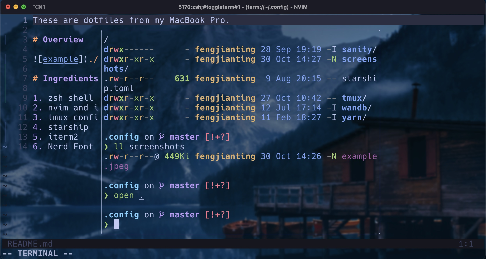
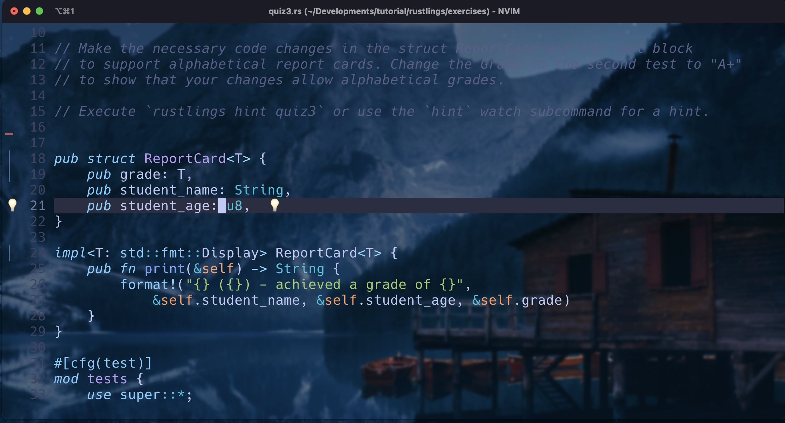
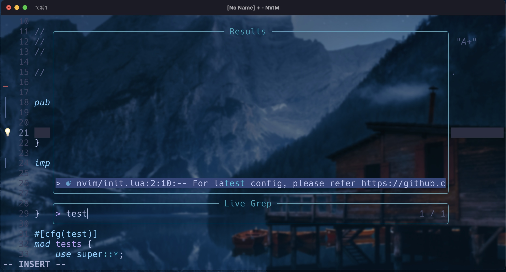

These are dotfiles from my MacBook Pro.

# Overview

### Colorscheme (tokyonight.nvim)

### Builtin Terminal (`<Ctrl>+<leader>`with `toggleterm.nvim`)

### Zen Mode (`<leader>z` with `zen-mode.nvim`)

Distraction free

### Telescope 

- `sf` for file search
- `;f` for all files
- `;h` for builtin help
- `;g` for live grep

live grep uses `ripgrep` (rust based grep alternative)

# Ingredients

1. zsh shell & oh-my-zsh
2. nvim and its plugins (maybe you need to install Packer)
3. tmux config file
4. starship
5. iterm2
6. Nerd Font Mono: [Hack](https://github.com/source-foundry/Hack)

# LICENSE

Feel free to use without any limitation (or license)
